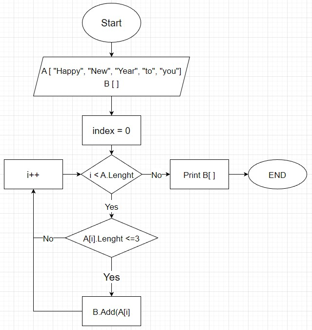

***Написать программу, которая из имеющегося массива строк формирует массив из строк, 
длина которых меньше либо ровна 3 символа.***

*Алгоритм решения задачи.*

1. Ввожу статический массив "string[] А" из строк разной длины.

2. Ввожу пустой динамический массив "List<string> B", куда в процессе программы будем добавлять строки удовлетворяющие условию задачи.

3. Пишем цикл со счетчиком, от 0 до конечной длины массива с шагом 1.

4. Пишем в условии критей отбора. В нашем случае длина слова должна быть <= 3.

5. Добавляем текущий элемент во второй массив.

6. В конце программы выводим второй массив.

7. Составляем блоксхему.

